# Exploring Out-of-Domain Performance in Rumor Detection Models: Comprehensive Evaluation Framework and Novel Dataset Filtering Methodologies
[](https://www.rdi.uwa.edu.au/innovations-in-action)
## Supervised by [**___Dr. JinHong___**](https://research-repository.uwa.edu.au/en/persons/jin-hong)

## Abstract
In the digital age, the rapid dissemination of information can sometimes lead to the spread of false rumors, potentially causing harm to individuals and communities. Hence, the importance of rumor detection is crucial. Current evaluation methods for rumor detection models often focus on a narrow range of performance metrics and lack a comprehensive assessment of real-world usability. In this study, we proposed a more exhaustive evaluation framework and presented a novel methodology for filtering datasets to optimize model performance.

We evaluated three rumor detection models, the Global-Local Attention Network model (GLAN), the Propagation Path Aggregating Neural Network model (PPA), and the Post-Level Attention Network model (PLAN). Through rigorous training and evaluation, we revealed that the PLAN model exhibits commendable adaptation to the out-of-domain context, consistently delivering an average performance of  54.60\% across all datasets.

Further, we introduced two dataset filtering methods, anomalous dataset filtering, and efficient out-of-domain training dataset filtering. Our methods identified both Twitter15 and Twitter16 as "anomalous datasets", and these similar datasets significantly influenced the PLAN model's performance. Remarkably, PLAN model trained using Twitter15 are able to demonstrate the strongest out-of-domain performance available, 8.51\% better performance than models trained on training sets that are not in "Efficient Out-of-Domain Training Datasets" dataset. We also introduce a group called "Efficient Out-of-Domain Training Datasets," comprising training datasets that enable the PLAN model to demonstrate excellent out-of-domain performance. Furthermore, we propose that in future studies, a detailed examination of the datasets comprising the "Efficient Out-of-Domain Training Datasets" be conducted. 

Future research should incorporate a broader range of rumor detection models and datasets to bolster the credibility and generalizability of our approach. By refining our methodology, we aim to advance the field of rumor detection, thereby promoting the dissemination of reliable content and mitigating the harmful impacts of false rumors.

## Contributions

The contributions of this paper are as follows:

1. **A New Multi-Metric Evaluation Framework**: We propose a comprehensive evaluation method using radar charts, incorporating six different metrics: speed, in-domain performance, out-of-domain performance, simplicity, reproducibility, and data processibility. This framework provides a robust approach for assessing the effectiveness of rumor detection models, surpassing traditional evaluation metrics.
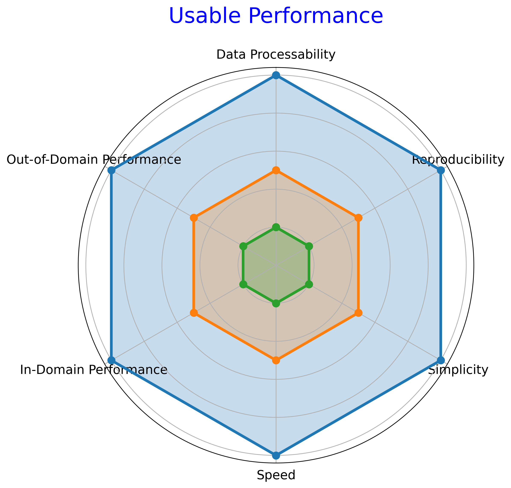
2. **Performance Comparative Experiments (Out-of-Domain vs Theoretical)**:Through extensive training and evaluation of the PLAN model with diverse datasets, we identify limitations in its generalizability and adaptability to unfamiliar datasets. However, the model achieves a remarkable average accuracy rate of approximately 50% on out-of-domain datasets.

3. **Two Dataset Filtering Methods**:
   - **Anomalous Datasets Filtering**: We explore the similarity between the Twitter15 and Twitter16 datasets, validating our filtering methodology and aligning with claims made by the dataset authors.
   - **Efficient Out-of-Domain Training Datasets Filtering**: We introduce a group of datasets called "Efficient Out-of-Domain Training Datasets," including Twitter15, Twitter16, Pheme, and Weibo. Our findings show that using Twitter15 as training data enables the PLAN model to exhibit excellent out-of-domain performance. We suggest a detailed examination of these datasets in future studies to uncover essential factors impacting the training efficiency of rumor monitoring models. By understanding these key elements, we can develop more effective training strategies and enhance performance in rumour detection and monitoring tasks.

These contributions provide valuable insights and methodologies for evaluating and improving the performance of rumor detection models. For more details, please refer to the paper.

## Expetiment Results
**[1] A New Multi-Metric Evaluation Framework**

**Acc Compare**

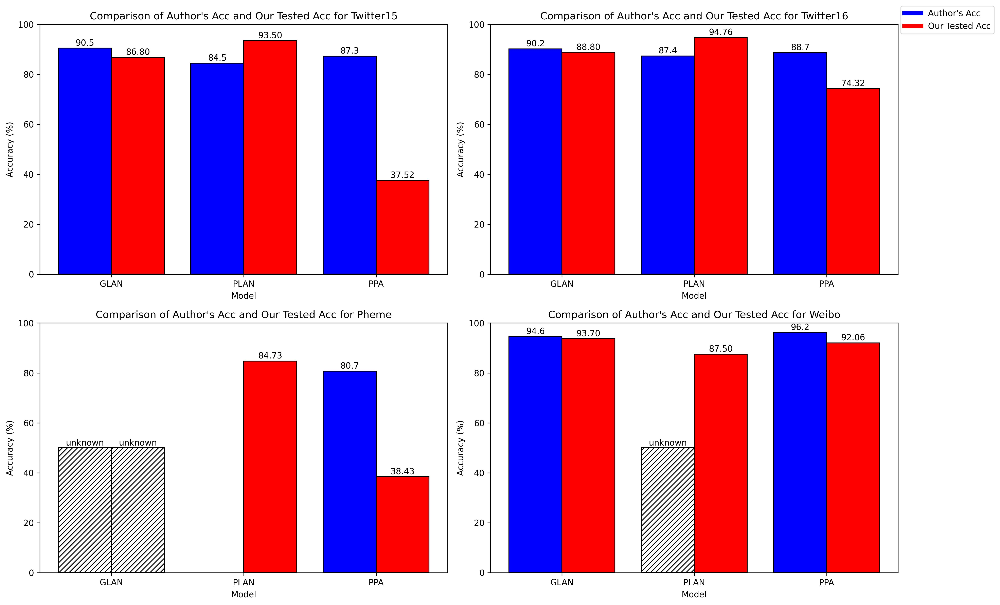

**F1 Compare**

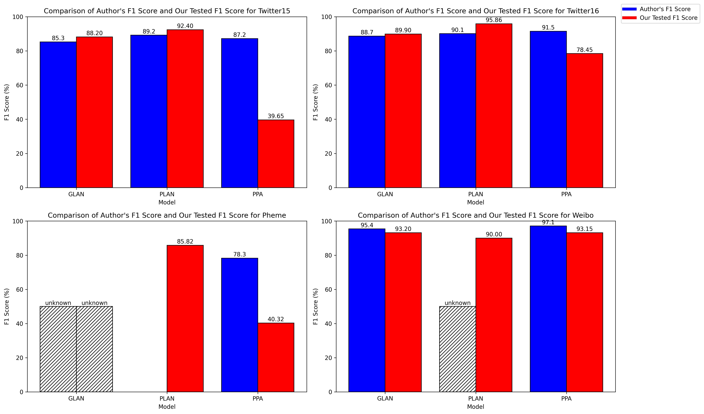

**Reproducibility**

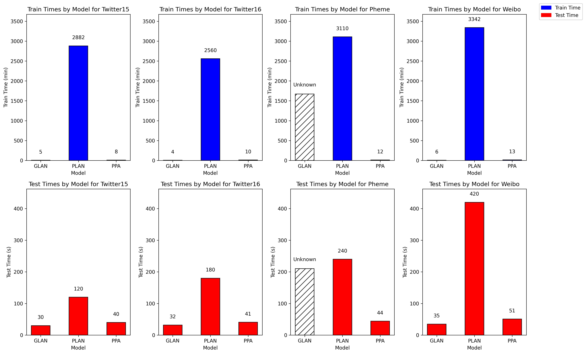

**Usable Performance**

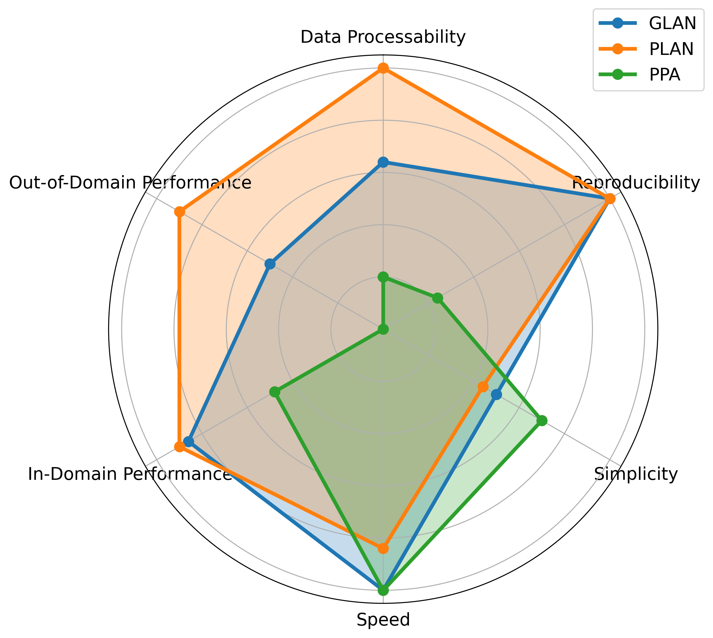

**[2] Performance Comparative Experiments (Out-of-Domain vs Theoretical)**

**PLAN Out of Domain Performance Acc**

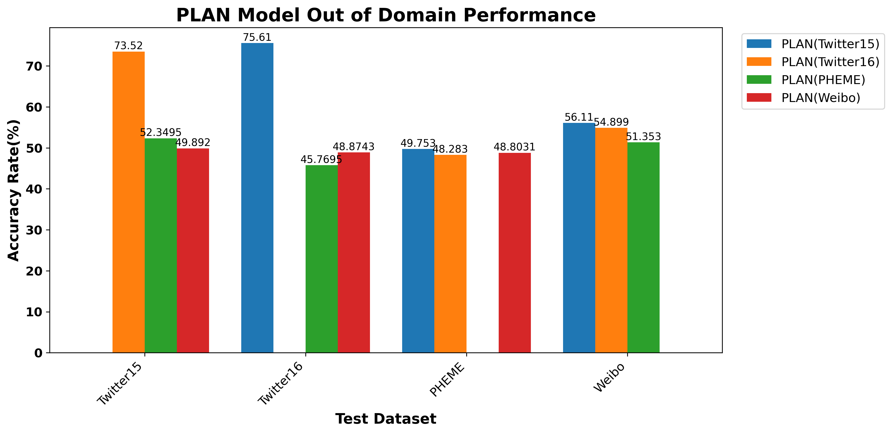

**PLAN Out of Domain Performance F1**

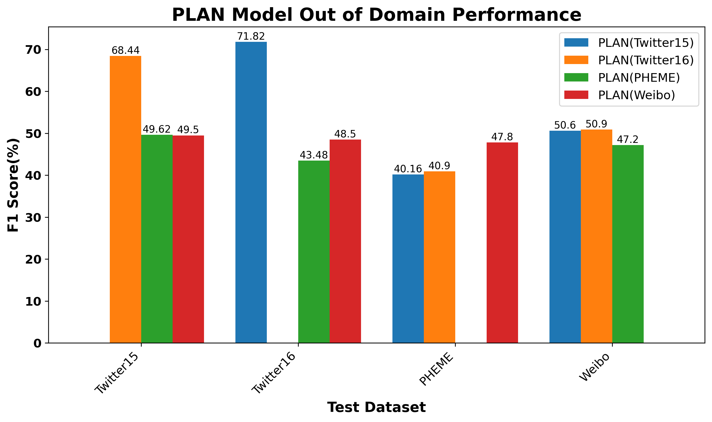

**PLAN-out-of-domain statistic**

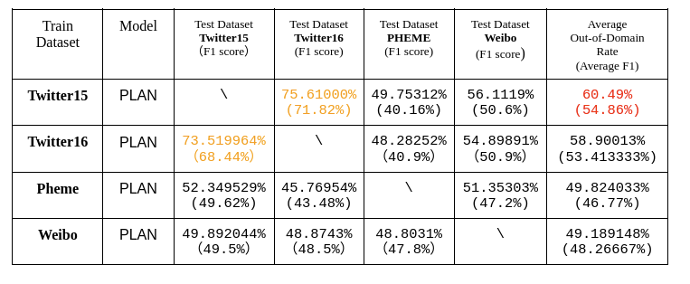

**[3] Datasets Research**

**Twitter 15**

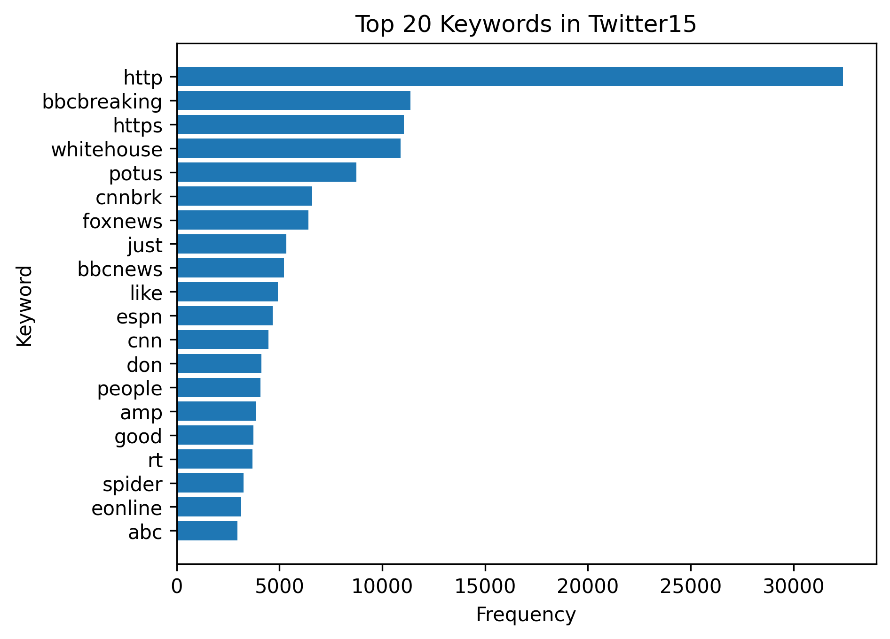


**Twitter 16**

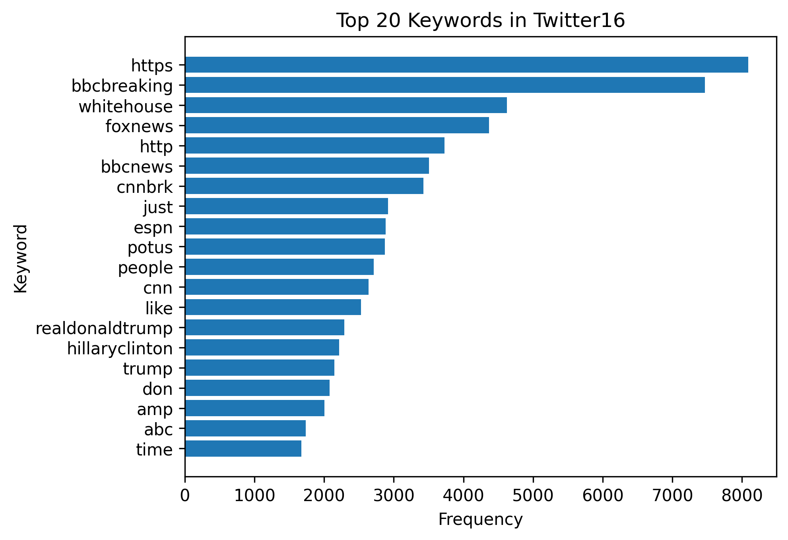


**Pheme**

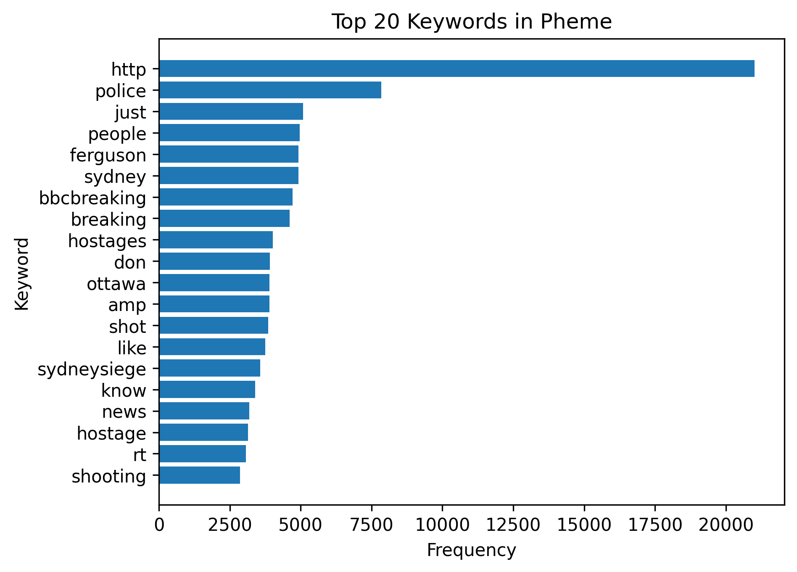


**Weibo**

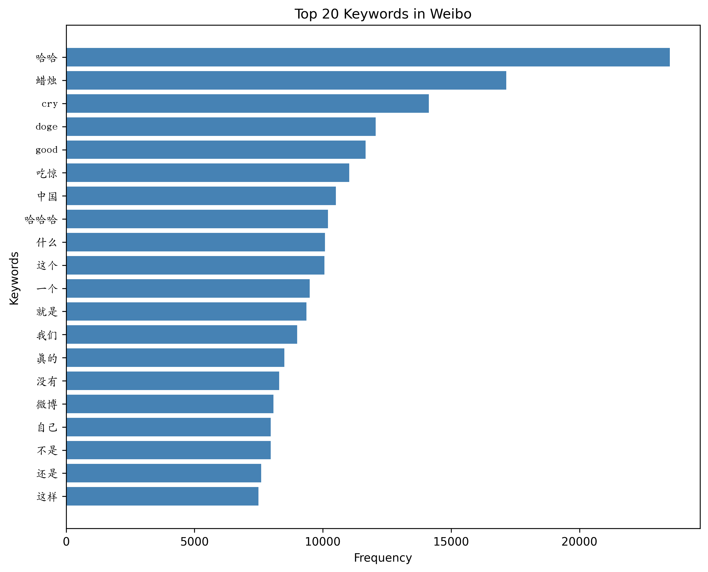


**Vn Graph**

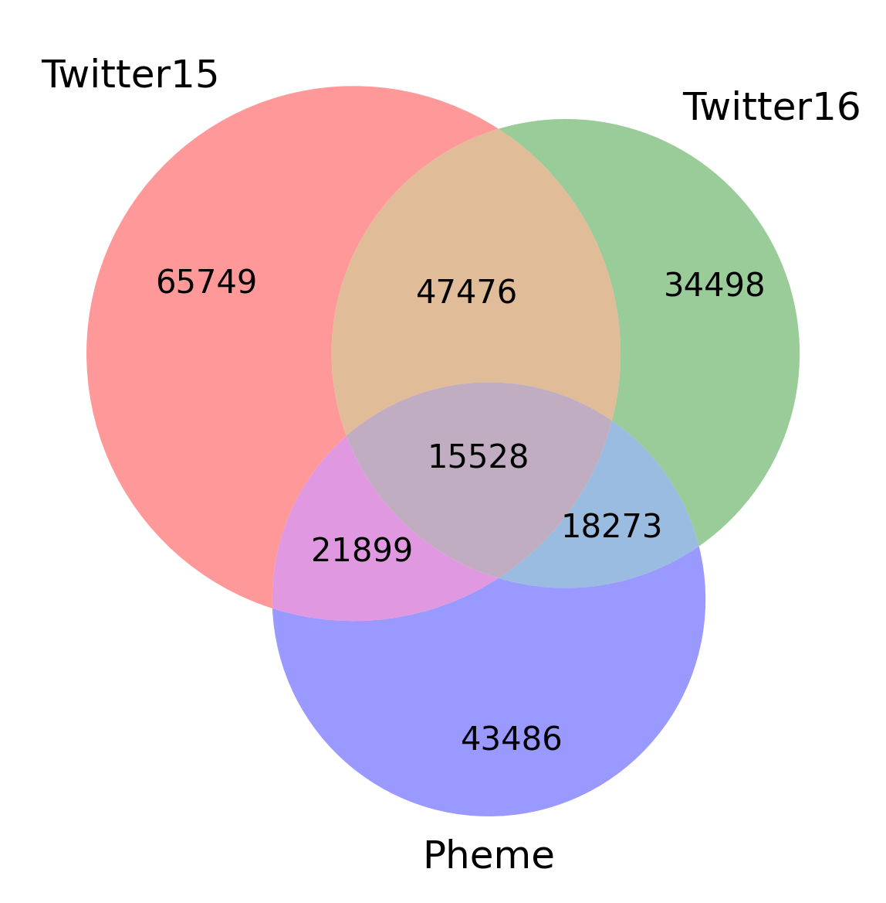

## Discussion Points
- Despite our thorough implementation of the proposed methods in the three rumor detection models and the validation of their feasibility, it is important to acknowledge the limitations of our study. We were only able to perform anomaly dataset screening and determine the best training set using the PLAN model. This limited scope is insufficient to provide a comprehensive assessment of our methods' effectiveness.
- Additionally, our study was conducted using a limited set of four datasets, namely Twitter15, Twitter16, Pheme, and Weibo. It remains unknown whether our methods will yield similar results when applied to other datasets. The generalizability of our findings to a broader range of datasets is an area that requires further exploration and investigation.
- Furthermore, we need to address the discrepancy between the expected optimal performance of the PPA model as described in the literature and our inability to achieve comparable results. Despite using the same computer equipment and machine configuration for all three models, only the PPA model encountered difficulties, hindering our ability to fully reproduce the experimental data associated with the PPA model.

## Future Works
Based on the further studies we carried out, we found some interesting insights from the "Efficient Out-of-Domain Training Datasets":
- Based on the analysis, Twitter15 had 65,749 non-repeating words, while Twitter16 had 34,498.
- The keyword frequency of Twitter15 was significantly higher than that of Twitter16.
- Twitter15 had a larger data volume in terms of total trees, total valid posts, and propagation paths compared to Twitter16.

These findings suggest that Twitter15 is more complex than Twitter16, despite showing similar domain performance. In future endeavors, comprehensive research can be conducted to delve deeper into the fundamental factors that impact the training efficiency of the model. This exploration can lead to the development of more efficient training datasets tailored to the model's needs, enhancing the efficiency of rumor detection and monitoring.

In future studies, it is crucial to incorporate additional state-of-the-art rumor detection models to further investigate and validate the feasibility of our proposed methodology. Utilizing more recent models will allow us to assess the effectiveness of our methods in the context of the latest advancements in the field. Moreover, employing more powerful computing resources will significantly enhance the speed of training and testing, resulting in improved efficiency and productivity.

Expanding the range of datasets used for testing is another important aspect to enhance the credibility of our approach. By filtering more anomalous datasets and conducting thorough analyses, we can refine the accuracy and reliability of our methodology.

By addressing these considerations in future research, we can further validate and strengthen the applicability and performance of our proposed methodology, ultimately advancing the field of rumor detection and enabling more effective handling of rumors in various contexts.

## Test
`Graph Tool.ipynb` contains multiple types of graphs.

Install dependencies:
```bash
pip install -r requirements.txt
```

## Rumor Research
https://github.com/Ameame1/rumor-detection
## Author
### Ame Liu
[](mailto:22910358@student.uwa.edu.au)

